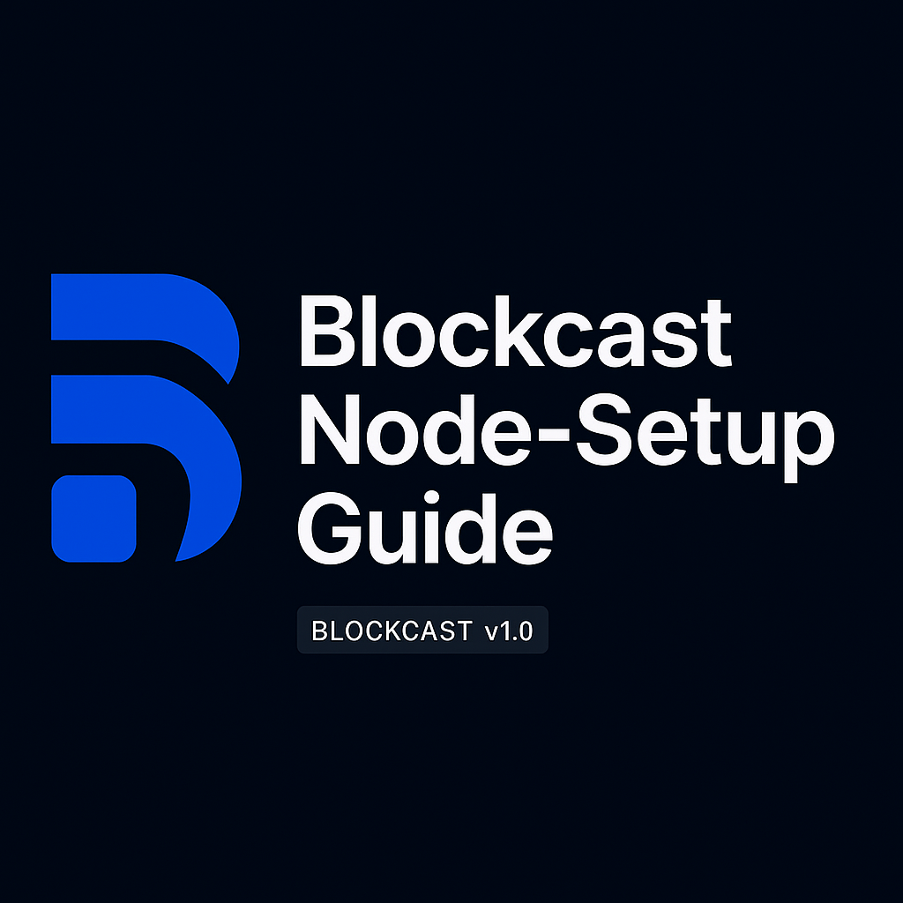
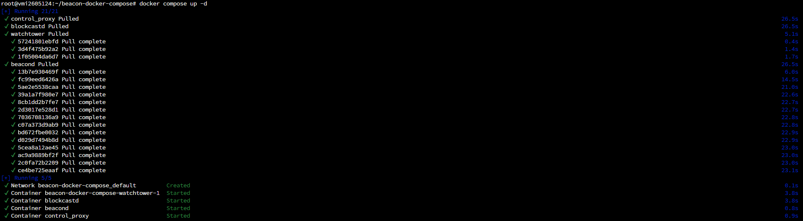
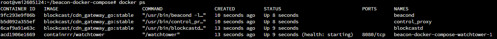
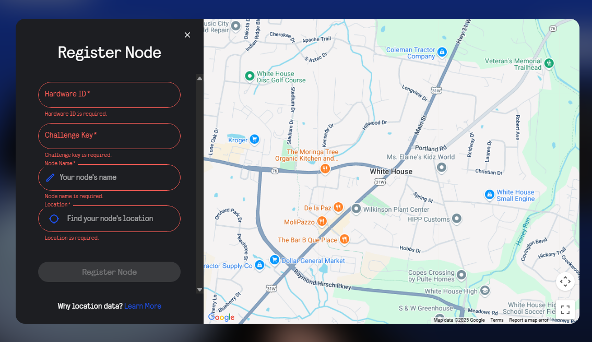

# Blockcast Node Setup Guide

This guide explains how to set up a Blockcast node on Ubuntu using Docker and Docker Compose.

---

## ⚙️ Requirements

- Ubuntu 20.04 or 22.04
- 2 vCPU & 4 GB RAM (minimum)
- Docker & Docker Compose
- Basic terminal knowledge
- Open ports (if behind NAT)
- Blockcast account with:
  - Email sign-up
  - Solana wallet connected
  - Twitter & Discord connected

---

## 🔧 1. Update the System

```bash
sudo apt update && sudo apt upgrade -y
sudo apt install ca-certificates curl gnupg lsb-release -y
```

---

## 🐳 2. Install Docker & Docker Compose

```bash
sudo mkdir -p /etc/apt/keyrings
curl -fsSL https://download.docker.com/linux/ubuntu/gpg | sudo gpg --dearmor -o /etc/apt/keyrings/docker.gpg

echo \
  "deb [arch=$(dpkg --print-architecture) signed-by=/etc/apt/keyrings/docker.gpg] \
  https://download.docker.com/linux/ubuntu \
  $(lsb_release -cs) stable" | \
  sudo tee /etc/apt/sources.list.d/docker.list > /dev/null

sudo apt update
sudo apt install docker-ce docker-ce-cli containerd.io docker-compose-plugin -y

sudo systemctl enable docker
sudo systemctl start docker
```

Verify installation:
```bash
docker --version
docker compose version
```

---

## 📁 3. Clone Blockcast Repository

```bash
git clone https://github.com/Blockcast/beacon-docker-compose.git
cd beacon-docker-compose
```

---

## 🚀 4. Run Node

```bash
docker compose up -d
```



Verify container status:

```bash
docker ps
```



---

## 🆔 5. Get Hardware ID & Challenge Key

```bash
docker compose exec blockcastd blockcastd init
```

This will output:
```
Hardware ID: xxxxxxxxxxxxx
Challenge Key: yyyyyyyyyyyyy
```

---

## 🌐 6. Register Your Node

1. Go to [Blockcast Node](https://app.blockcast.network?referral-code=EX3UaJ)
2. Sign up / Log in with your email
3. Connect your Solana wallet
4. Link Twitter & Discord
5. Open **Manage Node > Register Node**
6. Fill in the form:



7. Click **Register Node**

---

## 🧠 Notes

- Your node should stay online 24/7
- VPS recommended: Hetzner, Contabo, Oracle Cloud, etc.
- To check logs:
```bash
docker ps
docker logs -f blockcastd
```

---

## 🔗 Resources

- [Official Blockcast Repo](https://github.com/Blockcast/beacon-docker-compose)
- [Blockcast Platform](https://app.blockcast.network/)
